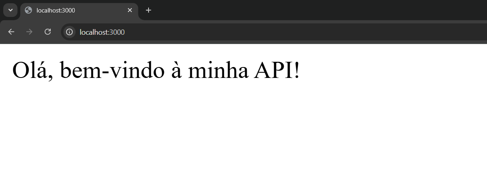
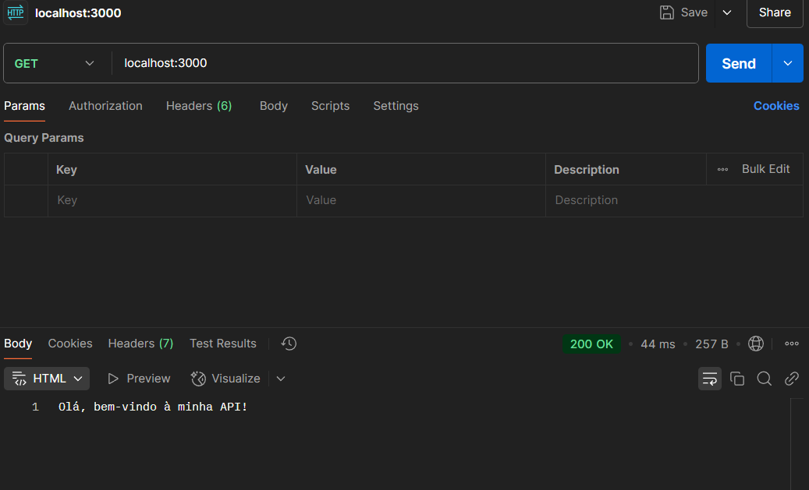
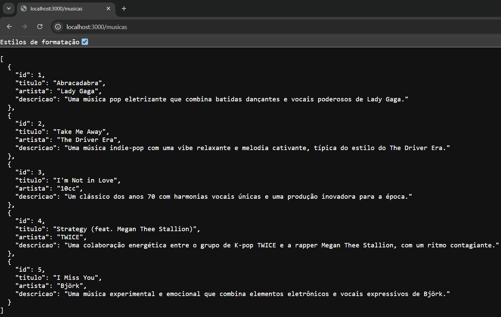
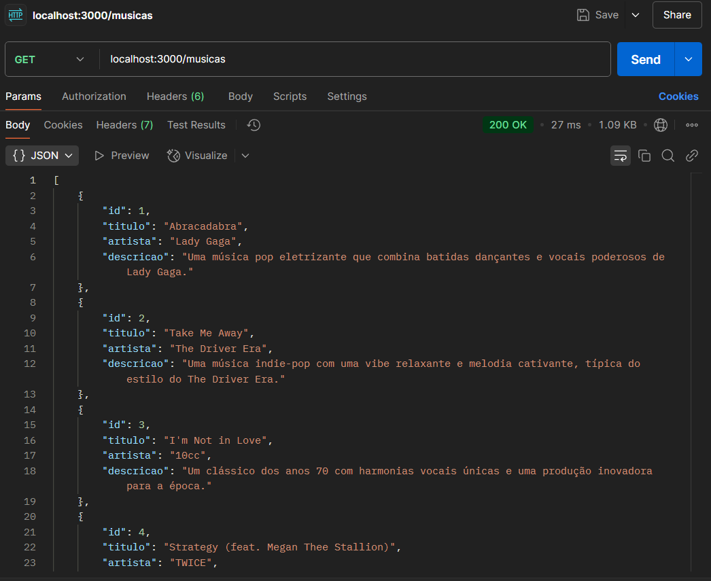
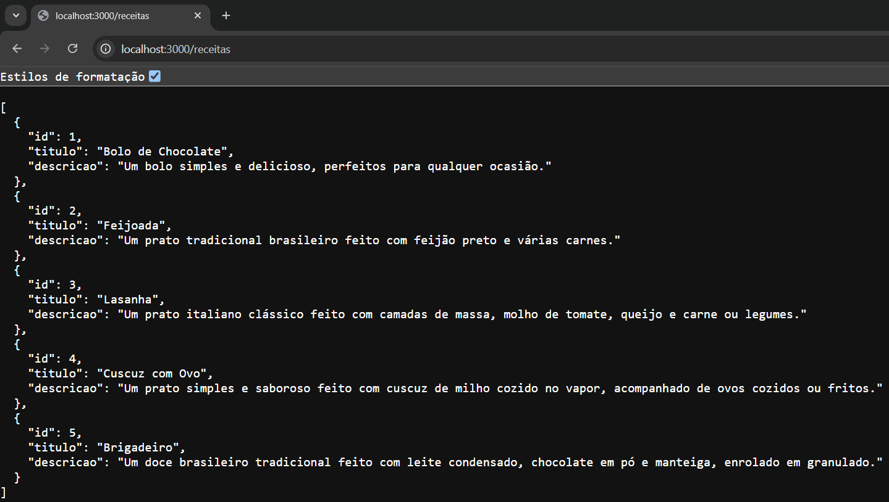
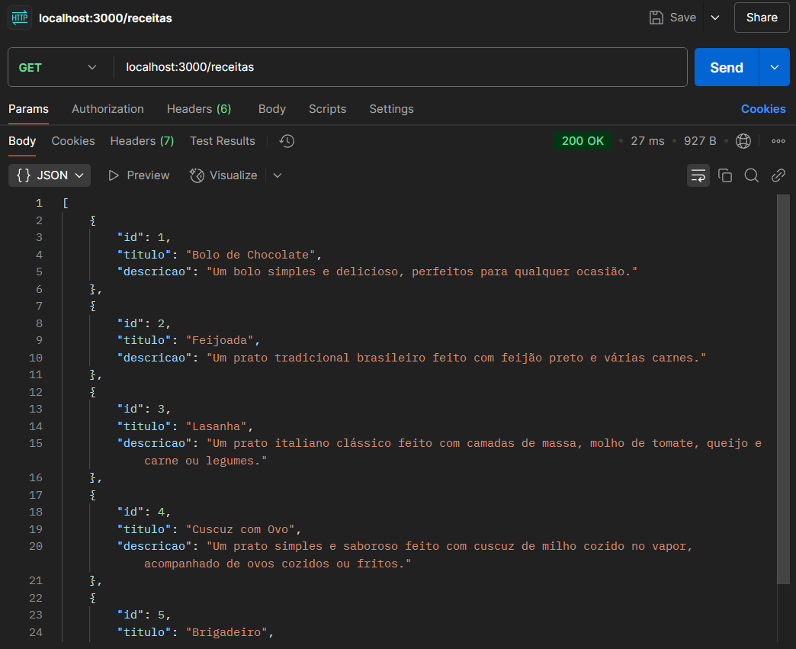

# Atvidade prática | Criando a primeira API RESTful

# Índice
* [Descrição do projeto](#descrição-do-projeto)
* [Funcionamento da API](#funcionamento-da-api)
    * [Rota raiz (/)](#rota-raiz)
    * [Rota /musicas](#rota-musicas)
    * [Rota /receitas](#rota-receitas)
* [Acessando o projeto](#acessando-o-projeto)

# Descrição do projeto
Atividade prática de criação de uma API RESTful básica utilizando Node.js e Express, capaz de listar informações estáticas.

# Funcionamento da API
## Rota **raiz (/)**:
### Navegador:

### Postman: 

## Rota **/musicas**:
### Navegador:

### Postman: 

## Rota **/receitas**:
### Navegador:

### Postman: 

# Acessando o projeto
1. Baixe o projeto 
2. Dê preferência por abrir no Visual Studio Code
3. Instale as dependências encontra-se no arquivo package.json
4. Execute o servidor no diretório do projeto com o comando node index.js

# Tecnologias utilizadas
* Node.js
* Express

# Autores

    
  <a href="https://github.com/mourajemima">Jemima Moura</a>

